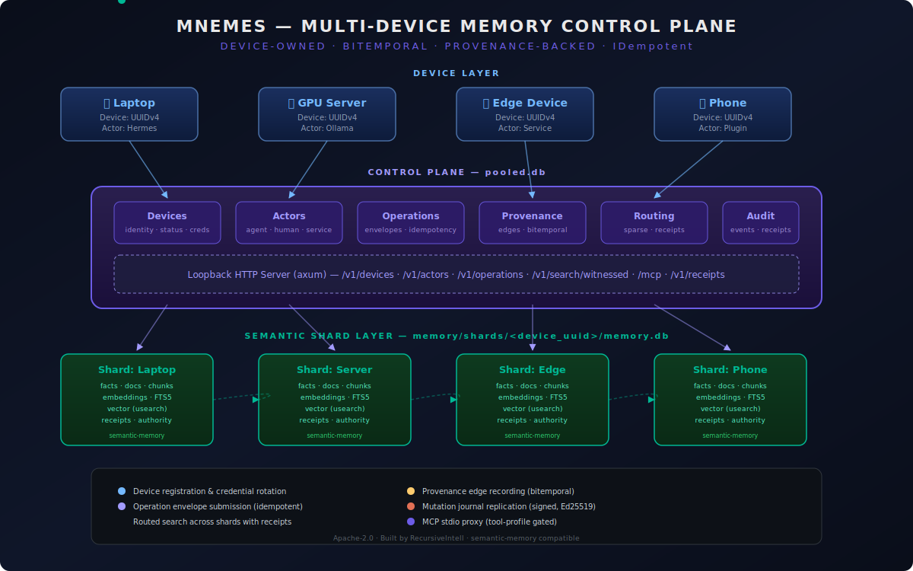
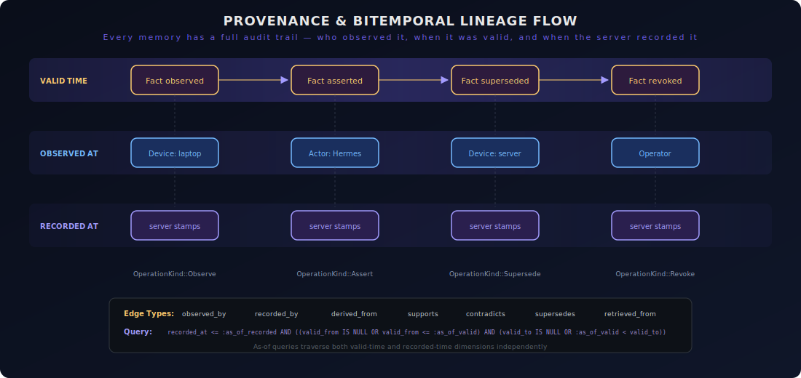
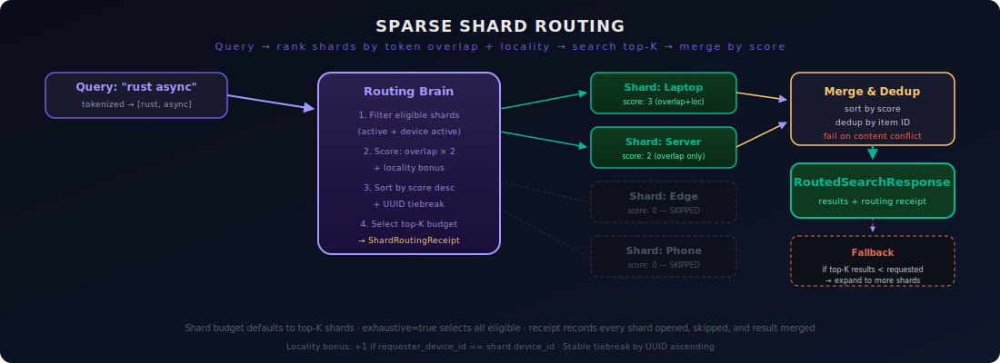

<div align="center">

# Mnemes

### Multi-device memory control plane for local-first AI agents

**Device-owned · Bitemporal · Provenance-backed · Idempotent**

[](https://crates.io/crates/mnemes)
[](https://docs.rs/mnemes)
[](LICENSE)
[](https://www.rust-lang.org/)
[](https://github.com/RecursiveIntell/semantic-memory)

</div>

---

<p align="center">
  
</p>

---

## Overview

**Mnemes** (from Greek μνήμη, "memory") is a Rust crate that adds a multi-device identity, synchronization, and routing layer on top of [`semantic-memory`](https://github.com/RecursiveIntell/semantic-memory). It enables a routing brain where laptops, GPU servers, edge devices, and phones can share authorized search results from separate device-owned stores while preserving full provenance:

| Capability | What it means |
| --- | --- |
| **Device identity** | Every memory item is tagged with which device observed or submitted it |
| **Actor identity** | Every operation records which agent, process, or human was responsible |
| **Operation provenance** | Durable envelopes with idempotency keys, content digests, and receipt IDs |
| **Bitemporal lineage** | When the observation was made (`valid_time`) vs. when the server recorded it (`recorded_at`) |
| **Server-owned timestamps** | `recorded_at` is always stamped by the accepting server — never trusted from clients |
| **Sparse shard routing** | Query-time ranking of device shards by token overlap + locality, with durable receipts |
| **Signed replication** | Ed25519-signed mutation envelopes for device-to-server journal replay (in development) |

> **Architecture status:** The current candidate implements server-side per-device shards and sparse routing. The target design keeps each canonical database on its home device and synchronizes a durable server replica. Continuous replication is under development — see [docs/DEVICE_OWNED_REPLICATED_MEMORY.md](docs/DEVICE_OWNED_REPLICATED_MEMORY.md).

## How it works

Mnemes is **additive metadata** on top of semantic-memory. It does not duplicate memory payloads. Two storage layers coexist:

```
pooled.db  ←  device/actor/operation/provenance/routing control plane
    │
    ├── devices (identity, status, credentials)
    ├── actors (agent kind, tool profile, device binding)
    ├── operation_envelopes (idempotent, receipted)
    ├── provenance_edges (bitemporal lineage graph)
    └── routing + sync receipts
    │
    ▼
memory/shards/<device_uuid>/memory.db  ←  one semantic-memory store per device
    │
    ├── facts, documents, episodes, conversations
    ├── embeddings, FTS5 indexes, vector (usearch)
    └── provenance, authority, search receipts
```

The control plane and semantic stores are **physically separate**. `pooled.db` owns pooling metadata and receipts. Each `memory.db` is owned by the `semantic-memory` engine. Once replication is implemented, the home-device generation is canonical and the server generation is a replayable replica.

### Embedding provider selection

Mnemes keeps the embedding provider behind `semantic_memory::Embedder`:

- local deployments default to the in-process Candle provider when the default `candle-local` feature is enabled;
- shared-pool operators may select Ollama/HTTP with `MNEMES_EMBEDDER=ollama`;
- library users may inject any provider implementation with `MnemesStore::open_with_embedder`;
- future peer-first routing will select a compatible connected provider before invoking the UNO Q/local fallback.

```bash
# Local default: Candle/Nomic, no Ollama service required
cargo run --bin mnemes-server

# Select an HTTP/Ollama-compatible provider for a shared pool
MNEMES_EMBEDDER=ollama \\
MNEMES_OLLAMA_URL=http://127.0.0.1:11434 \\
MNEMES_EMBEDDING_MODEL=nomic-embed-text \\
MNEMES_EMBEDDING_DIMENSIONS=768 \\
cargo run --bin mnemes-server
```

`EmbeddingConfig` remains the compatibility contract for model, dimensions, batch size, and timeout. A provider that returns a different dimension is rejected; mnemes does not silently mix embedding spaces. Provider selection is configuration, not proof that a remote peer broker is already active.

---

## Quick start

### Install

```bash
# From crates.io
cargo install mnemes --locked

# Or from source
git clone https://github.com/RecursiveIntell/mnemes.git
cd mnemes
cargo install --path .
```

### As a library

```rust
use mnemes::{MnemesStore, Device, DeviceId, Actor, ActorKind, ActorId};
use semantic_memory::{MemoryConfig, EmbeddingConfig, MockEmbedder};
use tempfile::TempDir;

#[tokio::main]
async fn main() {
    let dir = TempDir::new().unwrap();
    let config = MemoryConfig {
        base_dir: dir.path().to_path_buf(),
        embedding: EmbeddingConfig { dimensions: 768, ..Default::default() },
        ..Default::default()
    };

    let store = MnemesStore::open_with_embedder(
        dir.path().to_path_buf(),
        config,
        Box::new(MockEmbedder::new(768)),
    ).unwrap();

    // Register a device
    let dev_id = DeviceId::new();
    store.register_device(Device::new(dev_id.clone(), "laptop", "linux", "nobara-pc"))
        .await.unwrap();

    // Register an actor
    let actor_id = ActorId::new();
    store.register_actor(Actor::new(actor_id, dev_id.clone(), ActorKind::Hermes))
        .await.unwrap();

    // Access the underlying semantic-memory store for this device
    let memory = store.device_memory(&dev_id).await.unwrap();
    memory.add_fact("general", "Rust was first released in 2015", None, None)
        .await.unwrap();

    // Routed search across all eligible device shards
    let response = store.routed_search(
        "rust release history",
        10,
        &dev_id,
        None, None, // no namespace/source_type filters
        None,       // no shard budget (use default)
        false,      // not exhaustive
    ).await.unwrap();

    for result in &response.results {
        println!("[{}] score={:.4} {}", result.device_id, result.result.score, result.result.content);
    }
}
```

### Run the server

```bash
# Start the loopback HTTP server (default port 3000)
mnemes-server

# Custom port and data directory
mnemes-server 1738 ~/.local/share/mnemes

# Via environment variable
MNEMES_DATA_DIR=/var/lib/mnemes mnemes-server 1738
```

### Bootstrap a new store

```bash
# Offline admin bootstrap (generates device credential)
mnemes-admin bootstrap ~/.local/share/mnemes laptop linux myhostname
```

Output:
```json
{"device_id":"...","actor_id":"...","credential":"...","profile":"operator","created_at":"..."}
```

---

<p align="center">
  
</p>

---

## Architecture

### Three-layer design

| Layer | Owner | Contents |
| --- | --- | --- |
| **Device layer** | External devices | Laptops, servers, edge devices, phones — each with a UUIDv4 identity and Ed25519 credential |
| **Control plane** | `pooled.db` (Mnemes) | Device registry, actor registry, operation envelopes, provenance edges, routing receipts |
| **Shard layer** | `memory.db` × N (semantic-memory) | One independently addressable semantic store per registered device |

### Provenance schema

Every memory item can be linked to other items through typed, bitemporal provenance edges:

```sql
CREATE TABLE IF NOT EXISTS provenance_edges (
  edge_id TEXT PRIMARY KEY,
  edge_type TEXT NOT NULL CHECK (
    edge_type IN ('observed_by', 'recorded_by', 'derived_from', 'supports',
                 'contradicts', 'supersedes', 'retrieved_from')
  ),
  source_kind TEXT NOT NULL,
  source_id TEXT NOT NULL,
  target_kind TEXT NOT NULL,
  target_id TEXT NOT NULL,
  operation_id TEXT REFERENCES operation_envelopes(operation_id),
  actor_id TEXT REFERENCES actors(actor_id),
  device_id TEXT REFERENCES devices(device_id),
  valid_from TEXT,
  valid_to TEXT,
  observed_at TEXT,
  recorded_at TEXT NOT NULL,
  content_digest TEXT,
  metadata TEXT,
  supersedes_edge_id TEXT REFERENCES provenance_edges(edge_id),
  created_at TEXT NOT NULL DEFAULT (datetime('now'))
);
```

The bitemporal query predicate allows as-of queries along both time axes:

```sql
recorded_at <= :as_of_recorded
AND (:as_of_valid IS NULL OR
     ((valid_from IS NULL OR valid_from <= :as_of_valid)
      AND (valid_to IS NULL OR :as_of_valid < valid_to)))
```

---

<p align="center">
  
</p>

---

### Sparse shard routing

When a search query arrives, Mnemes doesn't blindly search every device shard. Instead:

1. **Filter** — Only active shards on active devices are eligible
2. **Score** — Each shard gets a score: `(token_overlap × 2) + locality_bonus`
   - Token overlap: how many query tokens match the shard's routing terms and namespaces
   - Locality bonus: +1 if the requesting device owns this shard
3. **Rank** — Sort by score descending, with stable UUID-ascending tiebreak
4. **Select** — Pick the top-K shards (configurable budget, defaults to top-K)
5. **Search** — Execute parallel searches on selected shards only
6. **Merge** — Sort results by score, deduplicate by item ID, fail on content conflict
7. **Fallback** — If insufficient results, expand to more shards with a durable fallback record

Every routing decision produces a **`ShardRoutingReceipt`** — a durable, HMAC-signed receipt that records which shards were eligible, ranked, selected, skipped, searched, and what they returned. The receipt does **not** store the raw query (only its SHA-256 hash) for privacy.

```rust
let response = store.routed_search(
    "rust async runtime",
    10,                    // top_k results
    &requester_device_id,
    Some(vec!["general".into()]),  // namespace filter
    None,                  // source type filter
    Some(3),               // shard budget: search at most 3 shards
    false,                 // not exhaustive (don't search all)
).await.unwrap();

let receipt = &response.routing_receipt;
println!("Searched {} of {} eligible shards",
    receipt.actual_selected_shard_count,
    receipt.eligible_shards.len());
```

---

<p align="center">
  
</p>

---

## API surface

### HTTP REST (loopback only, `127.0.0.1`)

| Method | Endpoint | Description |
| --- | --- | --- |
| `GET` | `/livez`, `/healthz` | Liveness/readiness check |
| `GET` | `/v1/health` | Full health with embedding model info |
| `GET` | `/v1/integrity` | SQLite integrity check across all shards |
| `POST` | `/v1/devices/register` | Register a new device, returns credential |
| `GET` | `/v1/devices` | List registered devices |
| `POST` | `/v1/devices/:id/heartbeat` | Device heartbeat |
| `POST` | `/v1/devices/:id/rotate` | Rotate device credential |
| `POST` | `/v1/devices/:id/revoke` | Revoke device |
| `POST` | `/v1/devices/:id/quarantine` | Quarantine device |
| `POST` | `/v1/actors` | Register an actor |
| `GET` | `/v1/actors` | List actors (optional `device_id` filter) |
| `POST` | `/v1/operations` | Submit an idempotent operation envelope |
| `GET` | `/v1/operations` | List operations (filter by device/actor) |
| `GET` | `/v1/operations/:id` | Get a specific operation |
| `POST` | `/v1/search/witnessed` | Routed witnessed search |
| `POST` | `/v1/sync` | Replication sync endpoint |
| `GET` | `/v1/receipts/:id` | Retrieve a durable receipt |
| `GET` | `/v1/audit/events` | List audit events |
| `POST` | `/mcp`, `/v1/mcp` | MCP JSON-RPC over HTTP |

All endpoints require a Bearer token (device credential). The server **fails closed** — no valid credential means no access.

### MCP tool profiles

| Profile | Tools | Access |
| --- | --- | --- |
| `agent` (default) | Read-only: search, get fact, graph path, namespaces, authority decisions, receipts, replay | No writes, no device management |
| `operator` | All agent tools + device registration, actor registration, operation submission, heartbeat, credential rotation, revocation | Full operational access |

### Admin CLI

```bash
mnemes-admin bootstrap <DATA_DIR> <LABEL> <PLATFORM> <HOSTNAME> [ACTOR_KIND]
```

`<ACTOR_KIND>` defaults to `human`. Supported kinds: `human`, `hermes`, `codex`, `ollama`, `service`, `plugin`, `process`.

**Security guidance:**
- Keep `<DATA_DIR>` under an operator-owned directory with `0700` permissions
- The credential output is single-use sensitive material — save it securely
- The bootstrap command exits non-zero if a device already exists in the data directory

---

## Operation envelopes

Every state-changing action is wrapped in an idempotent operation envelope:

```rust
use mnemes::{OperationEnvelope, OperationId, OperationKind};

let envelope = OperationEnvelope {
    operation_id: OperationId::new(),
    idempotency_key: "import-rust-facts-2026-07-20".to_string(),
    requesting_device_id: laptop_id.clone(),
    requesting_actor_id: hermes_actor.clone(),
    recording_device_id: laptop_id.clone(),
    recording_server_id: server_id.clone(),
    operation_kind: OperationKind::Assert,
    target_kind: "fact".to_string(),
    target_id: "rust-release-2015".to_string(),
    content_digest: "sha256:...".to_string(),
    observed_at: Some("2026-07-20T10:00:00Z".to_string()),
    valid_time: Some("2015-05-15T00:00:00Z".to_string()),
    recorded_at: String::new(), // server stamps this
    receipt_id: None,           // server assigns this
};

store.submit_operation(envelope).await.unwrap();
```

Supported operation kinds: `Observe`, `Assert`, `Supersede`, `Revoke`, `Redact`, `Adjudicate`.

---

## Replication (in development)

The target replication protocol uses **snapshot bootstrap** plus a **typed, signed semantic mutation journal** — not live SQLite/WAL file synchronization. Each mutation envelope is signed with Ed25519 and includes a canonical content digest:

```rust
use mnemes::replication::{MemoryMutationEnvelopeV1, SIGNATURE_DOMAIN_TAG};

// Domain-separated signing prevents cross-protocol signature reuse
// SIGNATURE_DOMAIN_TAG = b"mnemes/mutation-envelope/signature/v1\0"
// DIGEST_DOMAIN_TAG     = b"mnemes/mutation-envelope/v1\0"
```

See:
- [docs/DEVICE_OWNED_REPLICATED_MEMORY.md](docs/DEVICE_OWNED_REPLICATED_MEMORY.md) — target architecture
- [docs/DEVICE_OWNED_REPLICATION_IMPLEMENTATION_PLAN.md](docs/DEVICE_OWNED_REPLICATION_IMPLEMENTATION_PLAN.md) — implementation plan
- [docs/PHASE4_OPERATIONS.md](docs/PHASE4_OPERATIONS.md) — production deployment guide
- [docs/PHASE5_MIGRATION.md](docs/PHASE5_MIGRATION.md) — migration guide

---

## What Mnemes does NOT do

- **Does not replace semantic-memory.** Devices that prefer local-only memory use `semantic-memory` directly.
- **Does not duplicate claim-ledger trust authority.** Claim/evidence adjudication remains in [`claim-ledger`](https://github.com/RecursiveIntell/claim-ledger).
- **Does not automatically trust model-extracted memories.** Observations must be explicitly asserted or adjudicated.
- **Does not yet continuously replicate databases.** The researched target protocol is snapshot bootstrap plus signed mutation journal replay.

---

## Install as a systemd service

```bash
# Copy the service file
sudo cp ops/systemd/mnemes.service /etc/systemd/system/

# Edit the service file to set your data directory and user
sudo vim /etc/systemd/system/mnemes.service

# Enable and start
sudo systemctl daemon-reload
sudo systemctl enable mnemes
sudo systemctl start mnemes

# Check status
sudo systemctl status mnemes
```

---

## Configuration

| Environment variable | Default | Description |
| --- | --- | --- |
| `MNEMES_DATA_DIR` | `./data/mnemes` | Base directory for `pooled.db` and shard databases |
| `POOLED_MEMORY_DATA_DIR` | (legacy alias) | Same as `MNEMES_DATA_DIR` — backward compat |

Server defaults:
- **Port:** 3000 (configurable via CLI arg)
- **Bind:** `127.0.0.1` (loopback only — never exposed to the network)
- **Shard cache:** 4 shards (configurable via `open_with_embedder_and_cache_capacity`)

---

## Development

```bash
# Clone
git clone https://github.com/RecursiveIntell/mnemes.git
cd mnemes

# Check
cargo check

# Test (14 integration tests)
cargo test

# Run server locally
cargo run --bin mnemes-server -- 3000 ./data/mnemes

# Bootstrap a test store
cargo run --bin mnemes-admin -- ./data/mnemes test-device linux localhost
```

### Test suite

| Test file | Coverage |
| --- | --- |
| `tests/device_shards.rs` | Shard routing, ranking, cache, integrity, fallback, receipt verification |
| `tests/provenance_edges.rs` | Provenance edge CRUD, bitemporal queries, lineage traversal |
| `tests/bitemporal_lineage.rs` | Valid-time and recorded-time as-of queries |
| `tests/server.rs` | HTTP server endpoints, auth, device/actor registration |
| `tests/admin_cli.rs` | Admin bootstrap CLI |
| `tests/replication_protocol.rs` | Mutation envelope signing, verification, replay |
| `tests/replication_sync.rs` | Sync endpoint, snapshot bootstrap |

---

## Contract facts

| Property | Value |
| --- | --- |
| Crate name | `mnemes` |
| Version | `0.1.0` |
| Minimum Rust | `1.75` |
| License | Apache-2.0 |
| Default feature | `server` (axum HTTP + MCP) |
| Pooled schema generation | `1` |
| Storage | SQLite (rusqlite bundled) |
| Vector backend | usearch 2.25 (via semantic-memory) |
| Embedding | Candle in-process or Ollama (via semantic-memory) |
| Auth | Ed25519 device credentials + HMAC receipt signing |
| Server bind | `127.0.0.1` only (loopback) |

---

## License

Apache-2.0 — see [LICENSE](LICENSE).

---

<div align="center">

**Built by [RecursiveIntell](https://github.com/RecursiveIntell)** — local-first, operator-grade systems.

[semantic-memory](https://github.com/RecursiveIntell/semantic-memory) · [semantic-memory-mcp](https://github.com/RecursiveIntell/semantic-memory-mcp) · [claim-ledger](https://github.com/RecursiveIntell/claim-ledger) · [turbo-quant](https://github.com/RecursiveIntell/turbo-quant)

</div>