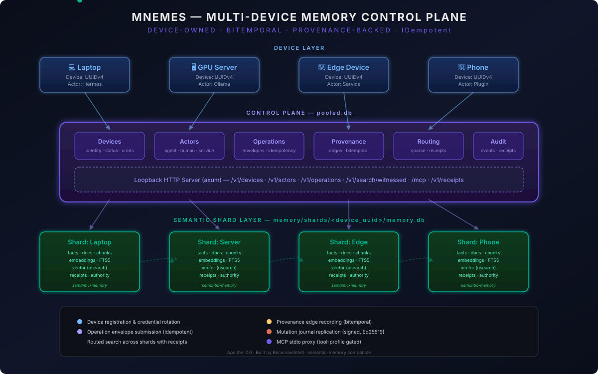
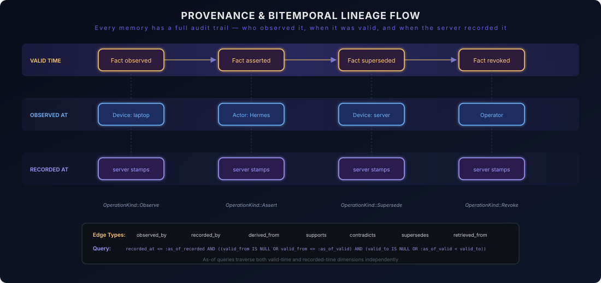
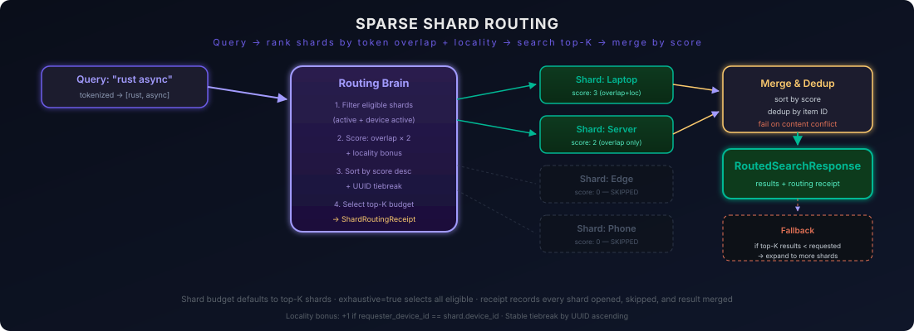

<div align="center">

# Mnemes

### Multi-device memory control plane for local-first AI agents

**Device-owned · Bitemporal · Provenance-backed · Idempotent**

[](https://crates.io/crates/mnemes)
[](https://docs.rs/mnemes)
[](LICENSE)
[](https://www.rust-lang.org/)
[](https://github.com/RecursiveIntell/semantic-memory)

</div>

---

<p align="center">
  
</p>

---

## Table of Contents

1. [Overview](#overview)
2. [Quick Start: Set Up a Server](#set-up-a-shared-memory-server)
3. [Architecture](#architecture)
4. [API Surface](#api-surface)
5. [Use as a Library](#use-as-a-library)
6. [The Semantic-Memory Engine](#the-semantic-memory-engine)
7. [Retrieval Pipeline](#retrieval-pipeline)
8. [Knowledge Graph](#knowledge-graph)
9. [Trust & Provenance](#trust--provenance)
10. [Data Model](#data-model)
11. [Memory Lifecycle](#memory-lifecycle)
12. [Performance & Scaling](#performance--scaling)
13. [Security & Governance](#security--governance)

---

## Overview

**Mnemes** (from Greek μνήμη, "memory") is a Rust crate that adds a multi-device identity, synchronization, and routing layer on top of [`semantic-memory`](https://github.com/RecursiveIntell/semantic-memory). It enables a routing brain where laptops, GPU servers, edge devices, and phones can share authorized search results from separate device-owned stores while preserving full provenance:

| Capability | What it means |
| --- | --- |
| **Device identity** | Every memory item is tagged with which device observed or submitted it |
| **Actor identity** | Every operation records which agent, process, or human was responsible |
| **Operation provenance** | Durable envelopes with idempotency keys, content digests, and receipt IDs |
| **Bitemporal lineage** | When the observation was made (`valid_time`) vs. when the server recorded it (`recorded_at`) |
| **Server-owned timestamps** | `recorded_at` is always stamped by the accepting server — never trusted from clients |
| **Sparse shard routing** | Query-time ranking of device shards by token overlap + locality, with durable receipts |
| **Signed replication** | Ed25519-signed mutation envelopes for device-to-server journal replay (in development) |

> **Architecture status:** The current candidate implements server-side per-device shards and sparse routing. The target design keeps each canonical database on its home device and synchronizes a durable server replica. Continuous replication is under development — see [docs/DEVICE_OWNED_REPLICATED_MEMORY.md](docs/DEVICE_OWNED_REPLICATED_MEMORY.md).

### The Full Stack

Mnemes is the **product surface** of a three-crate stack:

| Crate | Version | Role |
|-------|---------|------|
| [`semantic-memory`](https://crates.io/crates/semantic-memory) | v0.5.14 | Core library: SQLite store, HNSW vectors, FTS5 search, knowledge graph, trust ledger |
| [`semantic-memory-mcp`](https://crates.io/crates/semantic-memory-mcp) | v0.5.6 | MCP server: runtime-profiled tools for AI agents via stdio JSON-RPC |
| **`mnemes`** (this crate) | v0.1.1 | Multi-device control plane: identity, routing, replication, pooled memory |

## How it works

Mnemes is **additive metadata** on top of semantic-memory. It does not duplicate memory payloads. Two storage layers coexist:

```
pooled.db  ←  device/actor/operation/provenance/routing control plane
    │
    ├── devices (identity, status, credentials)
    ├── actors (agent kind, tool profile, device binding)
    ├── operation_envelopes (idempotent, receipted)
    ├── provenance_edges (bitemporal lineage graph)
    └── routing + sync receipts
    │
    ▼
memory/shards/<device_uuid>/memory.db  ←  one semantic-memory store per device
    │
    ├── facts, documents, episodes, conversations
    ├── embeddings, FTS5 indexes, vector (HNSW)
    └── provenance, authority, search receipts
```

The control plane and semantic stores are **physically separate**. `pooled.db` owns pooling metadata and receipts. Each `memory.db` is owned by the `semantic-memory` engine. Once replication is implemented, the home-device generation is canonical and the server generation is a replayable replica.

### Embedding provider selection

Mnemes keeps the embedding provider behind `semantic_memory::Embedder`:

- local deployments default to the in-process Candle provider when the default `candle-local` feature is enabled;
- shared-pool operators may select Ollama/HTTP with `MNEMES_EMBEDDER=ollama`;
- library users may inject any provider implementation with `MnemesStore::open_with_embedder`;
- the witnessed search endpoint now routes through `MnemesStore::routed_search()` when active shards with facts are registered, falling back to legacy single-store search only in test/single-device mode;
- future peer-first routing will select a compatible connected provider before invoking the UNO Q/local fallback.

```bash
# Local default: Candle/Nomic, no Ollama service required
cargo run --bin mnemes-server

# Select an HTTP/Ollama-compatible provider for a shared pool
MNEMES_EMBEDDER=ollama \
MNEMES_OLLAMA_URL=http://127.0.0.1:11434 \
MNEMES_EMBEDDING_MODEL=nomic-embed-text \
MNEMES_EMBEDDING_DIMENSIONS=768 \
cargo run --bin mnemes-server
```

`EmbeddingConfig` remains the compatibility contract for model, dimensions, batch size, and timeout. A provider that returns a different dimension is rejected; mnemes does not silently mix embedding spaces.

| Provider | Setup | Best for |
|---|---|---|
| **Candle** (default) | None — downloads nomic-embed-text-v1.5 from HuggingFace on first run (cached afterward) | Laptops and servers without a separate embedding service |
| **Ollama** | `ollama pull nomic-embed-text` then set `MNEMES_EMBEDDER=ollama` | GPU servers or deployments with an existing compatible embedding service |

If the server runs in a sandboxed environment (systemd `ProtectSystem=strict`), add `~/.cache/huggingface` to `ReadWritePaths` so Candle can cache the model, or set `HF_HUB_OFFLINE=1` after pre-downloading.

---

## Set up a shared memory server

> **Agent-driven setup:** Every step below is a shell command or file edit. Point your AI coding agent (Hermes, Claude Code, Codex, Cursor, etc.) at this README and say *"Set up a mnemes server on this machine"* — the agent can install, bootstrap, configure systemd, and verify, all from the instructions here.

Mnemes runs as a standalone HTTP server on any machine you choose — a home server, a VPS, a laptop, or a GPU box. Each device that connects to it gets its own isolated semantic-memory shard, and searches route across all eligible shards with durable receipts.

### 1. Install the binaries

```bash
# From crates.io (recommended)
cargo install mnemes --locked

# Or from source
git clone https://github.com/RecursiveIntell/mnemes.git
cd mnemes
cargo install --path .
```

This gives you two binaries:
- `mnemes-server` — the HTTP server
- `mnemes-admin` — the bootstrap/admin CLI

For a guided host install that also offers private anywhere-access:

```bash
./install.sh --from-source --with-tailscale
```

The Tailscale step is explicit and idempotent. It can install Tailscale when requested, pause for normal browser authorization (or consume an auth-key file without printing it), enable Tailscale SSH, and configure **Tailscale Serve** to proxy Mnemes over tailnet-only HTTPS. Mnemes remains bound to loopback; the installer never enables Funnel or opens a LAN listener. For an existing Mnemes installation, run:

```bash
./install.sh --tailscale-only
```

Audit without changing anything:

```bash
scripts/setup-mnemes-tailscale.sh --audit
```

### 2. Bootstrap the first device

```bash
mnemes-admin bootstrap ~/.local/share/mnemes "home-server" "linux" "myserver.local"
```

Output:
```json
{
  "device_id": "a1b2c3d4-...",
  "actor_id": "e5f6g7h8-...",
  "credential": "base64-encoded-credential",
  "profile": "operator",
  "created_at": "2026-07-21T..."
}
```

Save the `device_id` and `credential` — you'll need them to connect devices.

### 3. Start the server

```bash
# Basic: start on port 1738 with data at ~/.local/share/mnemes
mnemes-server 1738 ~/.local/share/mnemes

# With environment variables
MNEMES_PORT=1738 MNEMES_DATA_DIR=~/.local/share/mnemes mnemes-server
```

### 4. Run as a systemd service (recommended)

```ini
# ~/.config/systemd/user/mnemes.service
[Unit]
Description=Mnemes memory authority service
After=network.target

[Service]
Type=simple
EnvironmentFile=%h/.config/mnemes/server.env
ExecStart=%h/.cargo/bin/mnemes-server ${MNEMES_PORT} ${MNEMES_DATA_DIR}
Restart=on-failure
RestartSec=3
NoNewPrivileges=true
PrivateTmp=true
ProtectSystem=strict
ProtectHome=read-only
ReadWritePaths=%h/.local/share/mnemes %h/.cache/huggingface
LockPersonality=true

[Install]
WantedBy=default.target
```

```bash
mkdir -p ~/.config/mnemes
cat > ~/.config/mnemes/server.env << 'EOF'
MNEMES_PORT=1738
MNEMES_DATA_DIR=/home/you/.local/share/mnemes
# MNEMES_EMBEDDER=ollama
# MNEMES_OLLAMA_URL=http://127.0.0.1:11434
# HF_HUB_OFFLINE=1
EOF

systemctl --user daemon-reload
systemctl --user enable --now mnemes.service
systemctl --user is-active mnemes.service  # → active
```

### 5. Connect a device

```bash
curl -X POST http://your-server:1738/v1/devices/register \
  -H "Authorization: Bearer <opera...ial>" \
  -H "Content-Type: application/json" \
  -d '{"label":"laptop","platform":"linux","hostname":"mylaptop.local"}'
```

### 6. Verify

```bash
# Health check
curl http://127.0.0.1:1738/v1/health

# Search (requires auth)
curl -X POST http://127.0.0.1:1738/v1/search/witnessed \
  -H "Authorization: Bearer <devic...ial>" \
  -H "Content-Type: application/json" \
  -d '{"query":"test","limit":5}'
```

---

<p align="center">
  
</p>

---

## Architecture

### Three-layer design

| Layer | Owner | Contents |
| --- | --- | --- |
| **Device layer** | External devices | Laptops, servers, edge devices, phones — each with a UUIDv4 identity and Ed25519 credential |
| **Control plane** | `pooled.db` (Mnemes) | Device registry, actor registry, operation envelopes, provenance edges, routing receipts |
| **Shard layer** | `memory.db` × N (semantic-memory) | One independently addressable semantic store per registered device |

### Provenance schema

Every memory item can be linked to other items through typed, bitemporal provenance edges:

```sql
CREATE TABLE IF NOT EXISTS provenance_edges (
  edge_id TEXT PRIMARY KEY,
  edge_type TEXT NOT NULL CHECK (
    edge_type IN ('observed_by', 'recorded_by', 'derived_from', 'supports',
                 'contradicts', 'supersedes', 'retrieved_from')
  ),
  source_kind TEXT NOT NULL,
  source_id TEXT NOT NULL,
  target_kind TEXT NOT NULL,
  target_id TEXT NOT NULL,
  operation_id TEXT REFERENCES operation_envelopes(operation_id),
  actor_id TEXT REFERENCES actors(actor_id),
  device_id TEXT REFERENCES devices(device_id),
  valid_from TEXT,
  valid_to TEXT,
  observed_at TEXT,
  recorded_at TEXT NOT NULL,
  content_digest TEXT,
  metadata TEXT,
  supersedes_edge_id TEXT REFERENCES provenance_edges(edge_id),
  created_at TEXT NOT NULL DEFAULT (datetime('now'))
);
```

The bitemporal query predicate allows as-of queries along both time axes:

```sql
recorded_at <= :as_of_recorded
AND (:as_of_valid IS NULL OR
     ((valid_from IS NULL OR valid_from <= :as_of_valid)
      AND (valid_to IS NULL OR :as_of_valid < valid_to)))
```

---

<p align="center">
  
</p>

---

### Sparse shard routing

When a search query arrives, Mnemes doesn't blindly search every device shard. Instead:

1. **Filter** — Only active shards on active devices are eligible
2. **Score** — Each shard gets a score: `(token_overlap × 2) + locality_bonus`
   - Token overlap: how many query tokens match the shard's routing terms and namespaces
   - Locality bonus: +1 if the requesting device owns this shard
3. **Rank** — Sort by score descending, with stable UUID-ascending tiebreak
4. **Select** — Pick the top-K shards (configurable budget, defaults to top-K)
5. **Search** — Execute parallel searches on selected shards only
6. **Merge** — Sort results by score, deduplicate by item ID, fail on content conflict
7. **Fallback** — If insufficient results, expand to more shards with a durable fallback record

Every routing decision produces a **`ShardRoutingReceipt`** — a durable, HMAC-signed receipt that records which shards were eligible, ranked, selected, skipped, searched, and what they returned. The receipt does **not** store the raw query (only its SHA-256 hash) for privacy.

```rust
let response = store.routed_search(
    "rust async runtime",
    10,                    // top_k results
    &requester_device_id,
    Some(vec!["general".into()]),  // namespace filter
    None,                  // source type filter
    Some(3),               // shard budget: search at most 3 shards
    false,                 // not exhaustive (don't search all)
).await.unwrap();

let receipt = &response.routing_receipt;
println!("Searched {} of {} eligible shards",
    receipt.actual_selected_shard_count,
    receipt.eligible_shards.len());
```

---

<p align="center">
  
</p>

---

## API Surface

### HTTP REST (loopback only, `127.0.0.1`)

| Method | Endpoint | Description |
| --- | --- | --- |
| `GET` | `/livez`, `/healthz` | Liveness/readiness check |
| `GET` | `/v1/health` | Full health with embedding model info |
| `GET` | `/v1/integrity` | SQLite integrity check across all shards |
| `POST` | `/v1/devices/register` | Register a new device, returns credential |
| `GET` | `/v1/devices` | List registered devices |
| `POST` | `/v1/devices/:id/heartbeat` | Device heartbeat |
| `POST` | `/v1/devices/:id/rotate` | Rotate device credential |
| `POST` | `/v1/devices/:id/revoke` | Revoke device |
| `POST` | `/v1/devices/:id/quarantine` | Quarantine device |
| `POST` | `/v1/actors` | Register an actor |
| `GET` | `/v1/actors` | List actors (optional `device_id` filter) |
| `POST` | `/v1/operations` | Submit an idempotent operation envelope |
| `GET` | `/v1/operations` | List operations (filter by device/actor) |
| `GET` | `/v1/operations/:id` | Get a specific operation |
| `POST` | `/v1/search/witnessed` | Routed witnessed search |
| `POST` | `/v1/sync` | Replication sync endpoint |
| `GET` | `/v1/receipts/:id` | Retrieve a durable receipt |
| `GET` | `/v1/audit/events` | List audit events |
| `POST` | `/mcp`, `/v1/mcp` | MCP JSON-RPC over HTTP |

All endpoints require a Bearer token (device credential). The server **fails closed** — no valid credential means no access.

### MCP tool profiles

| Profile | Tools | Access |
| --- | --- | --- |
| `agent` (default) | Read-only: search, get fact, graph path, namespaces, authority decisions, receipts, replay | No writes, no device management |
| `operator` | All agent tools + device registration, actor registration, operation submission, heartbeat, credential rotation, revocation | Full operational access |

### Admin CLI

```bash
mnemes-admin bootstrap <DATA_DIR> <LABEL> <PLATFORM> <HOSTNAME> [ACTOR_KIND]
```

`<ACTOR_KIND>` defaults to `human`. Supported kinds: `human`, `hermes`, `codex`, `ollama`, `service`, `plugin`, `process`.

**Security guidance:**
- Keep `<DATA_DIR>` under an operator-owned directory with `0700` permissions
- The credential output is single-use sensitive material — save it securely
- The bootstrap command exits non-zero if a device already exists in the data directory

---

## Use as a library

```rust
use mnemes::{MnemesStore, Device, DeviceId, Actor, ActorKind, ActorId};
use semantic_memory::{MemoryConfig, EmbeddingConfig, MockEmbedder};
use tempfile::TempDir;

#[tokio::main]
async fn main() {
    let dir = TempDir::new().unwrap();
    let config = MemoryConfig {
        base_dir: dir.path().to_path_buf(),
        embedding: EmbeddingConfig { dimensions: 768, ..Default::default() },
        ..Default::default()
    };

    let store = MnemesStore::open_with_embedder(
        dir.path().to_path_buf(),
        config,
        Box::new(MockEmbedder::new(768)),
    ).unwrap();

    // Register a device
    let dev_id = DeviceId::new();
    store.register_device(Device::new(dev_id.clone(), "laptop", "linux", "nobara-pc"))
        .await.unwrap();

    // Register an actor
    let actor_id = ActorId::new();
    store.register_actor(Actor::new(actor_id, dev_id.clone(), ActorKind::Hermes))
        .await.unwrap();

    // Access the underlying semantic-memory store for this device
    let memory = store.device_memory(&dev_id).await.unwrap();
    memory.add_fact("general", "Rust was first released in 2015", None, None)
        .await.unwrap();

    // Routed search across all eligible device shards
    let response = store.routed_search(
        "rust release history",
        10,
        &dev_id,
        None, None, // no namespace/source_type filters
        None,       // no shard budget (use default)
        false,      // not exhaustive
    ).await.unwrap();

    for result in &response.results {
        println!("[{}] score={:.4} {}", result.device_id, result.result.score, result.result.content);
    }
}
```

## Operation envelopes

Every state-changing action is wrapped in an idempotent operation envelope:

```rust
use mnemes::{OperationEnvelope, OperationId, OperationKind};

let envelope = OperationEnvelope {
    operation_id: OperationId::new(),
    requesting_device_id: dev_id.clone(),
    requesting_actor_id: actor_id.clone(),
    recording_device_id: server_device_id.clone(),
    recording_server_id: server_id,
    operation_kind: OperationKind::AddFact,
    target_kind: "fact".into(),
    target_id: "namespace:general:fact:123".into(),
    content_digest: Some(sha256_hex(&content)),
    observed_at: Some(Utc::now()),
    valid_time: Some(Utc::now()),
    idempotency_key: format!("add-fact-{}-{}", dev_id, timestamp),
};

// Submit to server — server assigns operation_id and recorded_at
let receipt = client.submit_operation(&envelope).await?;
```

Key properties:
- **Idempotent**: Same `idempotency_key` always returns the original operation
- **Server-timestamped**: `recorded_at` is never trusted from clients
- **Content-verified**: `content_digest` is SHA-256, verified by server
- **Bitemporal**: `valid_time` (when observed) + `recorded_at` (when recorded)

---

## The Semantic-Memory Engine

Mnemes delegates all memory operations — storage, indexing, retrieval, graph traversal, trust verification — to `semantic-memory`. This section documents the engine's capabilities as exposed through Mnemes.

### Store Architecture

```
┌──────────────────────────────────────────────────────┐
│                 SEMANTIC-MEMORY ENGINE                │
│                                                       │
│  ┌─────────┐  ┌──────────┐  ┌────────────────────┐  │
│  │ SQLite  │  │  HNSW    │  │  Knowledge Graph   │  │
│  │ + FTS5  │  │  Vector  │  │  Typed edges       │  │
│  │         │  │  768-dim │  │  Communities        │  │
│  └────┬────┘  └────┬─────┘  │  Factor graphs      │  │
│       │            │        └─────────┬──────────┘  │
│       └────────────┼──────────────────┘              │
│                    │                                 │
│  ┌─────────────────▼──────────────────────────────┐ │
│  │            Trust Layer                          │ │
│  │  Claims → Evidence → Judgments → Receipts      │ │
│  │  Hash-chained ledger · Bitemporal versioning    │ │
│  └────────────────────────────────────────────────┘ │
└──────────────────────────────────────────────────────┘
```

### Tool Surface

The `semantic-memory-mcp` server exposes tools organized into functional groups. All tools share a common response envelope: `{ok, status, data, error, error_code}`.

**Search & Retrieval:** `sm_search` (hybrid BM25+vector+RRF), `sm_search_witnessed` (bypass-cache, durable receipt), `sm_search_with_routing` (adaptive with factor graph), `sm_search_proof_debt` (trust-index gated), `sm_search_as_of` (bitemporal), `sm_search_conversations`, `sm_route_query`, `sm_get_search_receipt`, `sm_replay_search`, `sm_benchmark_trust`, `sm_get_routing_policy`

**Knowledge Graph:** `sm_add_graph_edge` (Semantic/Temporal/Causal/Entity), `sm_list_graph_edges`, `sm_invalidate_graph_edge`, `sm_get_fact_neighbors`, `sm_graph_path` (BFS), `sm_community` (Leiden-inspired), `sm_topology` (Betti numbers), `sm_factor_graph` (belief propagation), `sm_decoder_analyze`, `sm_detect_contradictions`, `sm_subgraph_prune`

**Memory Management:** `sm_add_fact`, `sm_get_fact`, `sm_update_fact`, `sm_delete_fact`, `sm_supersede_fact`, `sm_consolidate_facts`, `sm_list_facts`, `sm_list_namespaces`, `sm_set_provenance`, `sm_ingest_document`

**Lifecycle:** `sm_run_lifecycle`, `sm_reconcile`, `sm_vacuum`, `sm_reembed_all`, `sm_embeddings_are_dirty`, `sm_stats`, `sm_compact_claim_ledger`

**Trust & Governance:** `sm_create_claim`, `sm_add_evidence`, `sm_judge_support`, `sm_verify_claim`, `sm_decide_assertion_authority`, `sm_decide_action_authority`, `sm_query_claim_versions`, `sm_query_evidence_refs`

**Utilities:** `sm_parse_json`, `sm_parse_choice`, `sm_parse_number`, `sm_parse_string_list`, `sm_repair_json`, `sm_strip_think_tags`, `sm_record_outcome`

## Retrieval Pipeline

```
Query → Query Profiler (RL routing) → Parallel: [BM25(FTS5) | Vector(HNSW) | Graph Exp]
                                         → RRF Fusion → Post-Processing → Results + Receipt
```

### Retrieval Stages

| Stage | Role | Activation boundary |
|-------|------|---------------------|
| **BM25 Coarse** | SQLite FTS5 lexical candidates | Baseline hybrid retrieval |
| **Vector Medium** | Vector candidates | Selected backend and embedding compatibility |
| **Graph Expansion** | Graph-neighbor analysis | Explicit graph/routing path |
| **Rerank Fine** | Authoritative `f32` comparison | Exact-rerank policy |
| **Decoder** | Contradiction analysis | Decoder feature and explicit use |
| **Discord** | Second-order graph retrieval | Discord feature and explicit use |

The RL routing policy is trained on feedback via `sm_record_outcome` and dynamically activates retrieval stages based on query characteristics.

### Search Variants

| Variant | Tool | Use Case |
|---------|------|----------|
| **Standard** | `sm_search` | Everyday hybrid retrieval |
| **Witnessed** | `sm_search_witnessed` | Auditable, replayable, cache-bypassed |
| **Adaptive** | `sm_search_with_routing` | Query-optimized with optional factor graph |
| **Proof-Debt** | `sm_search_proof_debt` | Trust-index gated, budgeted verification |
| **Bitemporal** | `sm_search_as_of` | "What did we know as of date X?" |
| **Conversation** | `sm_search_conversations` | Search past dialog history |

## Knowledge Graph

### Four Edge Types

| Type | Key Field | Semantics |
|------|-----------|-----------|
| **Semantic** | `cosine_similarity` (0.0-1.0) | Semantic relationship |
| **Temporal** | `delta_secs` (u64) | Fact A preceded Fact B |
| **Causal** | `confidence` (0.0-1.0) + evidence | Fact A caused Fact B |
| **Entity** | `relation` (string) | Named relationship |

### Graph Operations

| Operation | Tool | Description |
|-----------|------|-------------|
| **Community Detection** | `sm_community` | Leiden-inspired, configurable resolution, contradiction scanning |
| **Topology Analysis** | `sm_topology` | Betti numbers (β₀ components, β₁ cycles), structural voids |
| **Shortest Path** | `sm_graph_path` | BFS with configurable max_depth |
| **Factor Graph** | `sm_factor_graph` | Belief propagation over all edge types |
| **Subgraph Pruning** | `sm_subgraph_prune` | Access-frequency-based, dry-run default |
| **Contradiction Detection** | `sm_detect_contradictions` | Content-based: numeric, value, negation, antonym |

Edges are **never deleted** — they are invalidated with `sm_invalidate_graph_edge(edge_id, reason)`, preserving audit trails.

## Trust & Provenance

### Claim State Machine

```
draft → supported → contested → retracted
```

### Verification by Risk Class

| Risk Class | Requirements | Disposition |
|------------|-------------|-------------|
| **Low** | Cheap integrity checks | Auto-promote |
| **Medium** | + metadata validation | Promote with caveats |
| **High** | Falsification attempt required | Promote only if survives refutation |
| **Critical** | Replay + falsification | Quarantine if either fails |

### Governed Access

The system implements **purpose-isolated authority** — recall, assertion, action, export, and replay are never cross-purpose reusable. Delegation/elevation leases are scoped by namespace, purpose, audience, and expiration.

### Audit Trail

| Artifact | What It Proves |
|----------|---------------|
| **Claim Ledger** | Hash-chained, append-only history of all claims |
| **Search Receipts** | What was returned for a query at a point in time |
| **Replay Verification** | Results are reproducible (or not) |
| **Bitemporal Queries** | Who asserted what, when, with what valid-time |
| **Evidence Refs** | Trace evidence back to sources |

## Data Model

### Core Entities

```
Facts (UUID, content, namespace, source, memory_kind, sensitivity,
      embedding[768], valid_time, transaction_time, created_at, updated_at)

Documents → Chunks (auto-split, independently embedded and indexed)

Messages → Sessions (conversation history searchable)

Graph Edges (source→target, typed, weighted, invalidatable)

Claims → Evidence → Judgments (bitemporal, hash-chained)
```

### Memory Kinds

| Kind | Persistence |
|------|------------|
| `durable_fact` | Permanent |
| `preference` | Durable |
| `project_state` | Durable |
| `instruction_policy` | Durable |
| `correction` | Durable |
| `observation` | Durable |
| `episode_summary` | Durable |
| `skill_procedure` | Durable |
| `ephemeral_inference` | **Transient** — requires `evidence_refs` to promote |

### Sensitivity Classes

| Class | Autocapture | Search | Export |
|-------|------------|--------|--------|
| `public` | ✓ | Unrestricted | ✓ |
| `internal` (default) | ✓ | Namespace-scoped | With auth |
| `confidential` | **Blocked** | Governed | Blocked |
| `restricted` | **Blocked** | Governed | Blocked |

### Supersede Pattern

```
Old Fact (stale) ──supersedes──→ New Fact (current)
                                      │
                                Auto-filtered from default search
```

Use `sm_supersede_fact` for knowledge evolution — the old fact is preserved for audit but excluded from default queries.

---

## Memory Lifecycle

### Curation Workflow

```
PHASE 1: AUDIT (read-only)
  sm_stats → sm_list_facts → sm_community → sm_run_lifecycle → HEALTH REPORT

── USER APPROVAL ──

PHASE 2: RECONCILE
  sm_supersede_fact (default) | sm_consolidate_facts |
  sm_invalidate_graph_edge | sm_set_provenance
```

### Maintenance Operations

| Operation | Tool | Frequency | Est. Cost |
|-----------|------|-----------|-----------|
| Syndrome Detection | `sm_run_lifecycle` | Weekly | Low |
| FTS Rebuild | `sm_reconcile(RebuildFts)` | On corruption | Medium |
| Vacuum | `sm_vacuum` | After large deletes | Medium |
| Re-embed All | `sm_reembed_all` | After model change | High; measure on the target hardware and corpus |
| Claim Compaction | `sm_compact_claim_ledger` | Auto at threshold | Low |

### Guardrails

1. **Append-only**: Facts evolve through supersession, not deletion
2. **Artifact primacy**: Live repo/spec files outrank memory if they conflict
3. **Batch changes**: Group related mutations with receipt reasons
4. **Dry-run defaults**: Destructive operations preview before executing

---

## Performance & Scaling

### Measurement boundary

Latency, throughput, index size, and recall depend on the embedder, CPU/GPU,
storage, corpus shape, selected shards, search profile, and receipt settings.
This repository does not publish portable performance claims. Measure the exact
deployment with its configuration and retain raw outputs, corpus identity, and
binary version with any benchmark report.

### Compression Backends

| Backend | Technique | Trade-off |
|---------|-----------|-----------|
| **Standard** | Full f32 (3KB/fact) | Maximum recall |
| **fib-quant** | Fibonacci quantization | 8-16× compression |
| **turbo-quant** | Compressed-domain retrieval | Direct compressed search |
| **proveKV** | Extreme compression + f32 rerank | Coarse→fine pipeline |

### Scaling Characteristics

| Scale | SQLite Viability | Concern |
|-------|-----------------|---------|
| Small, single-device corpora | Suitable baseline | Verify local latency and recovery behavior |
| Multi-device corpora | Route across eligible shards | Validate selection, receipt, and fallback behavior |
| Large corpora | Capacity planning required | Benchmark ingestion, recovery, and search on the target host |

---

## Security & Governance

### Trust Boundaries

```
MCP stdio (local proc) → Tool Router (auth-less, local only)
HTTP :1738             → Bearer Token Gate (all endpoints)
                         → Governed Access Layer (purpose-isolated)
                           → SQLite File (filesystem ACLs)
```

### Attack Surface

| Surface | Risk | Mitigation |
|---------|------|------------|
| MCP stdio | Local process only | JSON-RPC parsing, no network exposure |
| HTTP admin | Network-accessible | Bearer token on ALL endpoints |
| SQLite file | Filesystem access | Unix permissions; sensitivity classes |
| Ollama embeds | Local network call | Same-host deployment |
| Fact injection | Text in LLM context | Sensitivity gates; governed recall |

### Governance Framework

```
Delegator ──delegates──→ Delegatee
                ├── Purposes: [recall, assertion, action, ...]
                ├── Scope: {namespace, domain, repo_id, workspace_id}
                ├── Audiences: [specific human/agent IDs]
                └── Expires: ISO8601 timestamp
```

Authority is **purpose-isolated** — a delegatee authorized for `recall` cannot assert or act. Cross-purpose reuse is never permitted.

---

## Project Structure

```
mnemes/                          # This crate
├── src/
│   ├── bin/
│   │   ├── mnemes-server.rs     # HTTP server binary
│   │   └── mnemes-admin.rs      # Bootstrap/admin CLI
│   ├── lib.rs                   # Library root
│   ├── store.rs                 # MnemesStore: multi-device control plane
│   ├── routing.rs               # Sparse shard routing
│   ├── devices.rs               # Device registry + credentials
│   ├── actors.rs                # Actor registry
│   ├── operations.rs            # Idempotent operation envelopes
│   └── replication.rs           # Ed25519-signed journal replay
├── scripts/
│   ├── mneme-codex-task.sh      # Codex CI task runner
│   ├── mneme-mcp-proxy.py       # MCP proxy for Hermes
│   └── setup-mnemes-tailscale.sh # Tailscale integration
├── ops/systemd/                 # systemd unit files
├── docs/                        # Architecture diagrams + specs
├── tests/                       # Integration tests
└── Cargo.toml
```

### Dependent crates (workspace members)

```
Libraries/                       # Canonical workspace
├── semantic-memory/             # Core library (v0.5.14)
├── semantic-memory-mcp/         # MCP server binary (v0.5.6)
├── semantic-memory-forge/       # Build/dev tooling
└── agent-graph-mcp/             # Graph-orchestrated LLM workflows
```

---

## Related Projects

| Project | Description |
|---------|-------------|
| [`semantic-memory`](https://crates.io/crates/semantic-memory) | Core engine: SQLite store, HNSW, FTS5, knowledge graph, trust ledger |
| [`semantic-memory-mcp`](https://crates.io/crates/semantic-memory-mcp) | MCP server with runtime-profiled tools for AI agents |
| [`agent-graph-mcp`](https://github.com/RecursiveIntell/Libraries) | Graph-orchestrated LLM workflows |
| [`agent-memory-kits`](https://github.com/RecursiveIntell/agent-memory-kits) | Hermes/Claude Code skill kits for memory operations |

---

## License

Apache-2.0

---

<p align="center">
  <em>Built with Rust · SQLite · HNSW · MCP · Ed25519</em>
</p>
